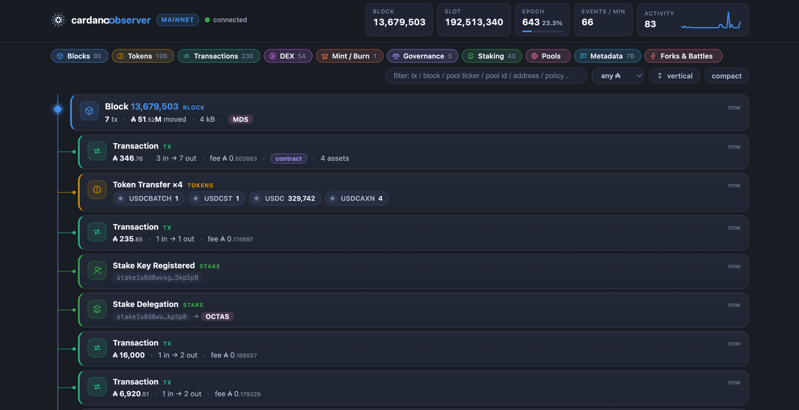
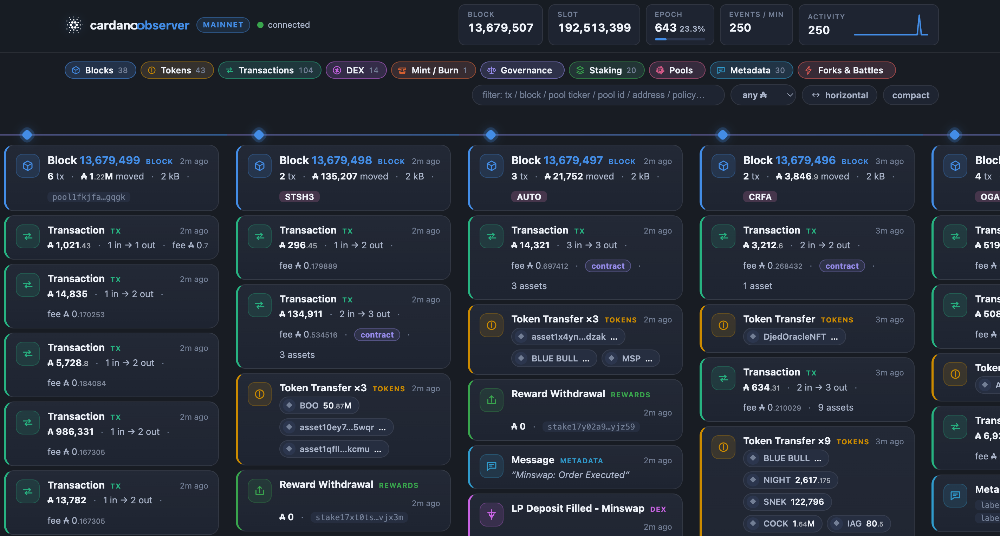

# cardano-observer

**A real-time chain event monitor for Cardano.** One lightweight Rust binary
follows your node's chain tip through Ogmios and streams *every* on-chain event
to a polished, zero-dependency web UI - transactions, token transfers, mints
and burns, staking and pool certificates, governance actions, votes, DReps,
reward withdrawals, metadata messages, and even chain forks, orphaned blocks
and slot battles.

**[Try it now!](https://observer.brock.tools/)**



## Features

- **Everything, live.** Chain-synced from the tip via Ogmios' WebSocket
  protocol, events reach the browser within milliseconds of the block arriving
  at your node.
- **The feed *is* the chain.** Blocks are nodes on a glowing spine; every
  event in a block hangs off it as a color-coded card. Works vertically
  (mobile & desktop) and horizontally (one column per block) - toggle anytime.
- **Fork visibility.** Rollbacks are detected from the chain-sync protocol
  itself: orphaned blocks are struck through and ribboned in place, a fork
  card explains the rollback, and when a competing block wins the same slot
  (or height) you get a **slot battle** card naming winner and loser.
- **DEX awareness.** Swap orders, batch settlements, cancellations, and LP
  deposits / redeems on every major Cardano DEX - Minswap (V1+V2), SundaeSwap
  (V1+V3), WingRiders (V1+V2), MuesliSwap, Splash/Spectrum and VyFi - detected
  from order-script credentials and pool NFTs, with buy / sell / swap /
  deposit / redeem inferred from the deposited assets. No separate DEX
  indexer needed.
- **History survives restarts.** Events and transaction details are persisted
  to append-only JSONL files (auto-compacted) and restored on startup, so the
  feed never starts empty. Chain-sync then resumes from the last persisted
  block, **backfilling everything that happened while the server was down** -
  including forks: a rollback that occurred offline still gets its orphan
  cards on the next start. Scroll (or search) further back through the full
  on-disk history via infinite load-more.
- **Full transaction modal.** Click any card for the complete transaction:
  inputs/outputs with amounts and asset chips, certificates, withdrawals,
  proposals, votes, metadata, raw JSON, and explorer links (mainnet or
  `preprod.` / `preview.` Cardanoscan, Cexplorer, AdaStat). Served from an
  in-memory cache; falls back to Blockfrost for older transactions.
- **Token & pool metadata.** Asset names, tickers, decimals and logos resolve
  from a durable CIP-26 token-registry cache (downloaded once into
  `DATA_DIR/token-registry.json`), with Blockfrost as a live fallback. Pool
  tickers come from a one-shot Blockfrost scrape into `DATA_DIR/pools.json`,
  with per-miss fetches appended afterward.
- **Delegation context.** Stake and vote re-delegations show **from → to**
  using an in-process tracker seeded from persisted history, with Blockfrost
  account lookups when the previous target is still unknown.
- **Filters that stick.** Per-category chips, free-text search (tx / block /
  address / policy / ticker / DEX name), URL deep-links (`?q=minswap`,
  `?NUTS`, …), a minimum-₳ filter, layout and density toggles - all cached in
  the browser's localStorage for your next visit. Searching a sparse window
  offers **Load more history** so you can extend the scan without leaving the
  tip.
- **Reading-friendly.** Scroll down and the feed pauses; a "new events" pill
  counts what you're missing and snaps you back to the tip when clicked.
- **Light on the host.** Builds to a single static binary (~6 MB) with a few
  tens of MB of RAM for the ring buffers, no database of its own, no JS build
  chain - the UI is three hand-written files embedded at compile time.

| Vertical layout | Horizontal layout |
|---|---|
|  |  |

## Event types

| Category | Color | Events |
|---|---|---|
| Blocks | blue | every block, with issuer pool, size, fees, output volume |
| Transactions | teal | every transaction: amounts, fees, in/out counts, contract flag |
| DEX | fuchsia | swap orders (buy/sell/swap), LP deposits/redeems, batch settlements, cancellations across all major DEXes |
| Tokens | gold | native asset transfers, enriched with registry metadata |
| Mint / Burn | orange | token mints and burns, incl. NFT name decoding (CIP-67/68 aware) |
| Staking | green | delegations (with from→to when known), stake key (de)registrations, reward withdrawals |
| Pools | magenta | pool registrations (pledge / margin / cost) and retirements |
| Governance | violet | governance actions, votes (DRep/SPO/CC), vote delegations (from→to), DRep lifecycle, committee changes |
| Metadata | cyan | transaction metadata incl. CIP-20 messages, shown verbatim |
| Forks & battles | red | rollbacks, orphaned blocks, slot & height battles |

## Requirements

- [Ogmios](https://ogmios.dev) attached to a `cardano-node` (**required** -
  this is the event source)
- [Blockfrost RYO](https://github.com/blockfrost/blockfrost-backend-ryo)
  (optional but recommended - token/pool metadata, account lookups, historical
  txs, and the one-shot pool-ticker scrape into `pools.json`)
- [cardano-db-sync](https://github.com/IntersectMBO/cardano-db-sync) **if you
  run Blockfrost RYO** - RYO is an API over a db-sync database, so enrichment
  and historical tx lookups need that stack behind `BLOCKFROST_URL`. The
  observer itself does not talk to db-sync directly.
- Rust 1.85+ to build (edition 2024)

Without Blockfrost, the live feed still works from Ogmios alone; token/pool
enrichment falls back to the on-disk CIP-26 registry cache, and older tx
modals may be incomplete.

## Quick start

Build and run locally - there is no pre-built binary to download.

```bash
git clone <this repo> && cd cardano-observer
cp .env.example .env        # point OGMIOS_URL / BLOCKFROST_URL at your services
./start.sh                  # cargo build --release, then run the binary
# → open http://<host>:9070
```

`./start.sh` copies `.env.example` if needed, cleans this package (so embedded
`static/` assets stay fresh), builds a release binary, and execs
`./target/release/cardano-observer`. Equivalent by hand:

```bash
cargo build --release
./target/release/cardano-observer
```

For local UI / Rust work, use `./start-dev.sh` instead - it watches `src/` and
`static/` with cargo-watch and rebuilds on change (the frontend is embedded via
`include_str!`, so a rebuild is required to pick up HTML/CSS/JS edits; refresh
the browser after each rebuild).

### Configuration (`.env`)

| Variable | Default | Purpose |
|---|---|---|
| `OGMIOS_URL` | `ws://127.0.0.1:1337` | Ogmios WebSocket endpoint (unused when `DEMO=true`) |
| `BLOCKFROST_URL` | *(unset / disabled)* | Blockfrost RYO base URL (optional; needs db-sync behind it). Example: `http://127.0.0.1:3000` |
| `BLOCKFROST_PROJECT_ID` | *(empty)* | `project_id` header, if your instance needs one |
| `TOKEN_REGISTRY_URL` | `https://tokens.cardano.org` | HTTP fallback for asset metadata when the local CIP-26 cache / Blockfrost miss |
| `TOKEN_REGISTRY_ZIP` | Cardano Foundation GitHub master zip | CIP-26 mappings zip used to build `token-registry.json` on first boot |
| `TOKEN_REGISTRY_REFRESH` | `false` | `true` / `1` / `yes` to re-download the registry zip |
| `POOL_CACHE_REFRESH` | `false` | `true` / `1` / `yes` to re-scrape Blockfrost `/pools` into `pools.json` |
| `NETWORK` | `mainnet` | `mainnet` \| `preprod` \| `preview` (addresses & explorer links) |
| `BIND` | `0.0.0.0:9070` | web UI listen address |
| `DATA_DIR` | `./data` | persisted event/tx history + registry/pool caches (JSONL/JSON); `none` / `off` / `false` disables persistence |
| `BACKFILL_HOURS` | `24` | resume chain-sync from the last persisted block if younger than this; `0` = start at tip |
| `EVENT_BUFFER` | `3000` | events kept in memory / replayed to new browsers |
| `TX_CACHE` | `4000` | transactions kept for the detail modal |
| `DEMO` | `false` | synthetic event stream - try the UI with no node (persistence off) |
| `RUST_LOG` | `info` | log level (`error` \| `warn` \| `info` \| `debug` \| `trace`) |

Slot→time and epoch math are discovered from the node itself
(`queryNetwork/startTime` + era summaries), so testnets and future eras work
without code changes.

### Try it without a node

Set `DEMO=true` in `.env` (or inline) and start as usual:

```bash
DEMO=true ./start.sh
# or, for a quick debug build:
DEMO=true cargo run
```

generates a realistic synthetic feed (blocks, tokens, governance, periodic
forks and slot battles) so you can explore the UI anywhere. Persistence is
disabled in demo mode so synthetic events never pollute a real `DATA_DIR`.

## Architecture

```
cardano-node ── Ogmios (chain-sync WS) ──▶ parse / DEX ──▶ ring buffer ──▶ WS fan-out ──▶ browser
                                              │                  │
                                              │                  └─ JSONL persist (DATA_DIR)
                                              │
                    ┌── token-registry.json ──┤
                    │                         │
Blockfrost RYO  ◀── enrichment / pools ───────┘
   └── cardano-db-sync (required by RYO)
```

- `src/ogmios.rs` - chain-sync client (find intersection at tip, pipelined
  `nextBlock`, automatic reconnect that resumes from the last seen blocks)
- `src/parse.rs` - one Ogmios block → many typed events; bech32 stake/pool/
  DRep/asset-fingerprint encoding, CIP-14/20/67 handling
- `src/dex.rs` - DEX order / fill / cancel / LP detection from script
  credentials and datums
- `src/state.rs` - event ring buffer, tx cache, orphan & battle bookkeeping,
  broadcast channel
- `src/persist.rs` - append-only JSONL history, restore + compaction
- `src/enrich.rs` - Blockfrost lookups (assets, accounts, historical txs) with
  in-memory caches
- `src/registry.rs` - CIP-26 token registry zip → durable slim cache
- `src/pools.rs` - Blockfrost pool-metadata scrape → `pools.json`
- `src/deleg.rs` - stake/DRep from→to tracker across live + restored events
- `src/server.rs` - axum server: embedded UI, `/ws` stream, `/api/events`,
  `/api/tx`, `/api/asset`, `/api/pool`, `/api/stats`
- `static/` - the whole frontend: one HTML file, one stylesheet, one script;
  no frameworks, no build step

### Notes

- The UI shows input *references* for live transactions (Ogmios doesn't
  resolve them); configure Blockfrost (and therefore cardano-db-sync) to get fully
  resolved inputs for historical lookups.
- Event colors were chosen as a colorblind-checked categorical palette; every
  card also carries an icon and a text label, so color never stands alone.
- The feed keeps the last ~90 block groups in the DOM and the server replays
  the last 250 events to each new browser tab; older history is available via
  infinite scroll / search load-more against persisted JSONL.

## License

MIT
